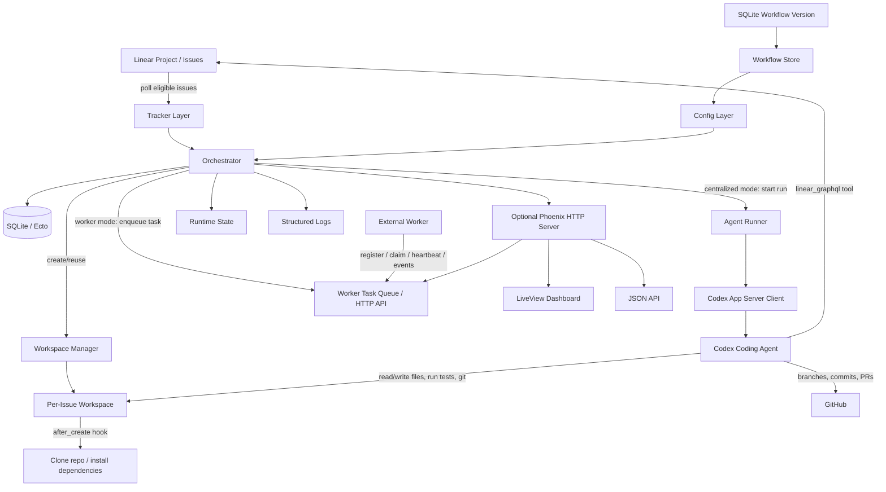
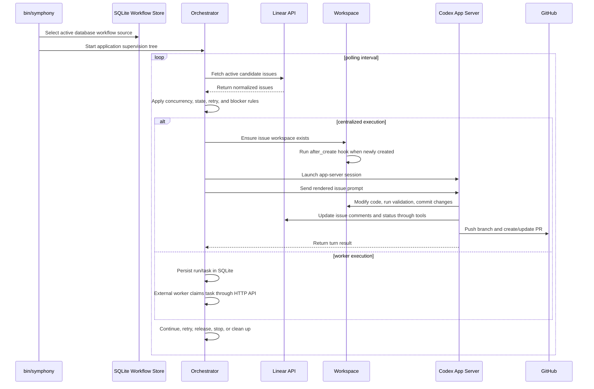

# Symphony Architecture Design

## 1. Overview

Symphony is an orchestration service for autonomous coding-agent work. It continuously reads work
items from an issue tracker, creates an isolated workspace for each eligible issue, starts a Codex
App Server session in that workspace, and lets the agent execute the repository-defined workflow.

The repository contains two major parts:

- `SPEC.md`: language-agnostic service specification.
- `elixir/`: experimental Elixir/OTP reference implementation.

The current implementation targets Linear as the tracker and Codex App Server as the coding-agent
runtime.

## 2. Goals

- Poll project work from Linear on a fixed cadence.
- Dispatch eligible issues with bounded concurrency.
- Create and preserve isolated per-issue workspaces.
- Run lifecycle hooks to prepare and clean workspaces.
- Launch Codex App Server sessions with issue-specific prompts.
- Keep runtime behavior configurable through the active SQLite workflow version.
- Persist projects, workflow versions, issues, runs, agent turns, workspaces, worker tasks, leases,
  and events in SQLite when the Repo is available.
- Provide logs, JSON state APIs, Linear diagnostics, worker APIs, and a Phoenix LiveView dashboard.
- Stop or clean up active runs when issue states become terminal.

## 3. Non-Goals

- Symphony is not a general-purpose workflow engine.
- Symphony is not a multi-tenant control plane.
- Symphony does not implement project-specific ticket or PR policy in code; that policy belongs in
  Settings-managed workflow/profile configuration and agent skills.
- Symphony does not replace the coding agent. It schedules, isolates, prompts, and observes agent
  work.

## 4. High-Level Architecture



## 5. Runtime Flow



## 6. Main Components

### 6.1 CLI

Location: `elixir/lib/symphony_elixir/cli.ex`

The CLI is the escript entrypoint built as `elixir/bin/symphony`. It accepts:

- `--logs-root <path>` to choose the log output root
- `--port <port>` to enable the Phoenix observability server
- `--database-path <path>` to choose the SQLite database file

The CLI stores runtime overrides, selects database workflow mode, prepares SQLite, and starts the
Elixir application. If no active workflow version exists, Symphony enters setup-required mode and
the Settings UI creates the first active workflow.

### 6.2 Workflow Loader

Locations:

- `elixir/lib/symphony_elixir/workflow.ex`
- `elixir/lib/symphony_elixir/workflow_store.ex`

The workflow store reads the active SQLite `workflow_versions` row, parses the saved workflow
package, and keeps the prompt body as the shared base prompt. If no active workflow exists, it
returns a setup-required sentinel that does not poll Linear or schedule agents.

### 6.3 Config Layer

Locations:

- `elixir/lib/symphony_elixir/config.ex`
- `elixir/lib/symphony_elixir/config/schema.ex`

The config layer applies defaults and converts workflow settings into typed runtime values. It
handles tracker settings, polling interval, workspace paths, hooks, agent concurrency, Codex command
settings, sandbox settings, worker SSH host settings, and optional server settings.

### 6.4 Tracker Layer

Locations:

- `elixir/lib/symphony_elixir/tracker.ex`
- `elixir/lib/symphony_elixir/linear/adapter.ex`
- `elixir/lib/symphony_elixir/linear/client.ex`
- `elixir/lib/symphony_elixir/linear/issue.ex`

The tracker layer normalizes external issue data into Symphony's internal issue model. The Linear
adapter fetches candidate issues, fetches issue state for reconciliation, and identifies terminal
issues during cleanup.

### 6.5 Orchestrator

Locations:

- `elixir/lib/symphony_elixir/orchestrator.ex`
- `elixir/lib/symphony_elixir/status_dashboard.ex`

The orchestrator owns the runtime loop. It polls the tracker, dispatches issues, enforces
concurrency, tracks active runs, handles retries, releases completed work, stops ineligible work,
and publishes status information. In centralized mode it starts `AgentRunner` locally or over
configured SSH hosts. In worker mode it persists worker tasks and lets external workers claim them
through `/api/worker/v1/*`.

### 6.6 Workspace Manager

Locations:

- `elixir/lib/symphony_elixir/workspace.ex`
- `elixir/lib/symphony_elixir/path_safety.ex`

The workspace manager maps issue identifiers to deterministic filesystem paths. It creates
workspaces, runs lifecycle hooks, and removes workspaces for terminal issues. Workspace isolation is
central to Symphony's execution model: each agent operates inside the issue-specific repository
copy. In centralized SSH-host execution, workspace preparation and hooks run on the selected SSH
host.

### 6.7 Agent Runner

Locations:

- `elixir/lib/symphony_elixir/agent_runner.ex`
- `elixir/lib/symphony_elixir/prompt_builder.ex`

The agent runner prepares the prompt for a specific issue and starts the Codex App Server client. It
reports run lifecycle events and outcomes back to the orchestrator.

### 6.8 Codex App Server Integration

Locations:

- `elixir/lib/symphony_elixir/codex/app_server.ex`
- `elixir/lib/symphony_elixir/codex/dynamic_tool.ex`

This layer launches and communicates with Codex App Server. It also exposes a client-side
`linear_graphql` dynamic tool so repository skills can make raw Linear GraphQL calls during agent
sessions.

### 6.9 Observability

Locations:

- `elixir/lib/symphony_elixir/log_file.ex`
- `elixir/lib/symphony_elixir/http_server.ex`
- `elixir/lib/symphony_elixir_web/*`

Symphony exposes runtime visibility through structured logs and an optional Phoenix service. When a
port is configured, the service provides:

- `/`: LiveView dashboard
- `/api/v1/state`: full state snapshot
- `/api/v1/<issue_identifier>`: issue-specific state
- `/api/v1/refresh`: manual refresh endpoint
- `/runs`, `/events`, `/workers`, `/settings/*`: management pages
- `/diagnostics/linear`: validation for the active Linear runtime configuration

### 6.10 Persistence and Worker API

Locations:

- `elixir/lib/symphony_elixir/persistence.ex`
- `elixir/lib/symphony_elixir/persistence/*`
- `elixir/lib/symphony_elixir_web/controllers/worker_api_controller.ex`

The persistence context owns SQLite-backed records for projects, workflow versions, runs, agent
turns, workspaces, worker identities, worker sessions, worker tasks, task leases, and events. The
worker API supports registration, task claim, heartbeat/lease renewal, and task event reporting.
Worker registration requires `SYMPHONY_WORKER_REGISTRATION_TOKEN`.

## 7. Configuration Model

The active workflow is a SQLite-backed workflow version. Operators create and update it through the
Settings UI; startup can enter setup-required mode when no active workflow version exists.
`workflow.yml` and `profiles.yml` are split package artifacts for import/export and examples, not
startup authority.

Important configuration areas:

- `tracker`: Linear project, API key, active states, terminal states.
- `polling`: poll interval.
- `workspace`: root directory for per-issue workspaces.
- `hooks`: shell commands for workspace lifecycle events.
- `agent`: concurrency and turn limits.
- `codex`: app-server command, approval policy, sandbox settings.
- `worker`: SSH host routing for centralized remote execution.
- `server`: optional dashboard/API port.

## 8. State and Ownership Boundaries

Symphony owns:

- polling cadence
- issue eligibility checks
- per-issue workspace creation
- process supervision
- retry scheduling
- run status and observability

The agent owns, through the workflow prompt and tools:

- implementation changes
- tests and validation
- Linear workpad comments
- Linear state transitions
- branch, commit, and PR operations
- reviewer feedback handling

This split keeps Symphony generic while allowing teams to encode shared execution policy in Settings
and repository skills. Project-specific repository and Linear slug values live in project settings,
while workflow routing and agent policy remain shared.

## 9. Failure Handling

Symphony is designed for long-running operation and transient failure recovery:

- Missing startup workflow configuration enters setup-required mode instead of polling Linear.
- Dashboard-first `--port` mode can boot without an active workflow, so the first workflow can be
  created through `/settings/workflow`.
- Invalid workflow reloads are logged, while the last known good database workflow remains active.
- Failed agent turns can be retried according to orchestrator policy.
- Active runs are stopped when issue states become terminal or ineligible.
- Terminal issues trigger cleanup of matching workspaces.
- Runtime details are written to logs and exposed through the optional status API.

## 10. Security and Trust Model

The Elixir implementation is explicitly marked as prototype software for trusted environments. It can
launch Codex with broad authority depending on Settings-managed workflow configuration.

Security-sensitive controls include:

- Codex command and inherited environment variables.
- Workspace root and lifecycle hooks.
- Codex approval policy.
- Codex thread and turn sandbox settings.
- Credentials such as `LINEAR_API_KEY`, GitHub auth, SSH keys, and Codex auth.

Operators should review Settings-managed workflow/runtime configuration before enabling listening,
and should avoid using this preview implementation in untrusted repositories or untrusted host
environments.

## 11. Running Locally

Install project tool versions with `mise`:

```bash
cd elixir
mise trust
mise install
```

Install dependencies and build the executable:

```bash
mise exec -- mix setup
mise exec -- mix build
```

Run without the dashboard:

```bash
export LINEAR_API_KEY=...
mise exec -- ./bin/symphony
```

Run with the dashboard:

```bash
export LINEAR_API_KEY=...
mise exec -- ./bin/symphony --port 4000
```

Run checks:

```bash
cd elixir
mise exec -- make all
```

## 12. Extension Points

Common extension areas:

- Add another tracker adapter behind the tracker abstraction.
- Customize issue-state policy in Settings / Workflow.
- Add workspace hooks for project-specific setup and teardown.
- Add repository-local Codex skills for commit, push, PR, Linear, or release workflows.
- Extend the Phoenix dashboard or JSON API for operator needs.
- Implement another language runtime from `SPEC.md` while keeping the same architecture boundaries.

## 13. Repository Map

```text
.
├── README.md
├── SPEC.md
├── ARCHITECTURE.md
└── elixir
    ├── README.md
    ├── workflow.yml
    ├── profiles.yml
    ├── Makefile
    ├── mise.toml
    ├── mix.exs
    ├── lib
    │   ├── symphony_elixir
    │   └── symphony_elixir_web
    └── test
```
