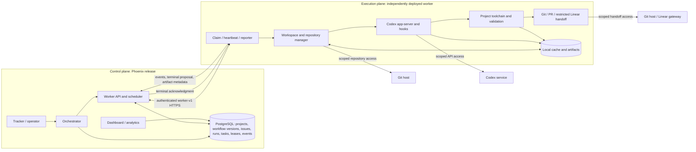

# External Execution Runtime Design

## 1. Status, scope, and ownership

This L3 document owns the **proposed production execution-runtime contract**: what runs outside
the Phoenix release, how one leased task is executed, how validation and artifacts are reported,
and how execution reconciles with the persisted Panel lifecycle. It does not redefine the landed
Panel queue, authentication, claim, heartbeat, lease, or event protocol owned by
[worker-panel-decoupling-design.md](worker-panel-decoupling-design.md).

The distinction is deliberate:

- **Current** means behavior already present in this repository.
- **Proposed** means the selected target for follow-up implementation.
- **Deferred** means intentionally excluded from the first production worker.

This ticket changes documentation only. All schema, API, runtime, dashboard, deployment, and
default-mode changes below are follow-up work. Existing L4 contracts remain authoritative for
current orchestration, agent execution, Linear handoff, observability, and safety; see
[spec.md](spec.md), [spec-agent-runner.md](spec-agent-runner.md),
[spec-orchestration.md](spec-orchestration.md),
[spec-reliability-security.md](spec-reliability-security.md), and [logging.md](logging.md).

## 2. Decision

### 2.1 Selected topology

Use one independently deployable, out-of-process worker runtime per worker instance. It actively
registers, claims, renews, and reports through `/api/worker/v1/*`. The worker contains repository
cache/worktree management, Codex app-server and turns, hooks, the project toolchain, validation,
artifact handling, and git/PR/Linear handoff.

Validation runs in the same worker task and lease, in an isolated child process in the claimed
workspace. There is no separately scheduled verifier in the initial topology. A verifier would add
a second queue, lease, cancellation path, artifact transfer boundary, and reconciliation problem
without improving reproducibility: reproducibility comes from a pinned worker image, immutable
workflow version, repository revision, and declared gate commands. A future verifier requires a
demonstrated stronger isolation requirement and its own design.



The Phoenix image becomes a control-plane artifact: no project checkout, Codex executable, build
compiler, or project toolchain is required in it once centralized execution is retired. The worker
image owns those dependencies. This resolves the current single-image tension without bloating the
Panel release.

**SYM-7 disposition:** do not add the Elixir/Mix build toolchain to the existing `symphony`
control-plane image. Supersede SYM-7's single-image approach with the worker-image/toolchain work
defined here. If SYM-7 remains open, narrow it to building and verifying the first project-specific
worker image; no runtime code is part of SYM-8.

### 2.2 Boundaries

| Boundary | Control plane | Execution plane |
| --- | --- | --- |
| Trust | Validates worker identity, protocol, lease fencing, payload shape, and report size; never trusts claimed capabilities or paths as authorization. | Treats task payload, repository content, issue text, hooks, and model output as untrusted input. |
| Filesystem | Owns database and control-plane logs; never mounts or reads worker workspaces. | A non-root process owns a configured absolute workspace root and cache/artifact roots. Resolved worktree and command cwd must remain beneath the workspace root; caches are mounted separately and never used as cwd. |
| Secrets | Stores hashes/references and issues scoped worker credentials. Does not send the Panel's database or global Linear secret. | Receives only worker registration/session credentials plus project-scoped repository, Codex, PR, and restricted Linear-tool credentials. Secrets are injected at runtime, excluded from payloads/logs/artifacts, and rotated independently. |
| Network | Accepts authenticated worker HTTPS and serves persisted metadata. | Default-deny except Panel, Codex endpoint, configured repository/PR host, dependency registries required by the pinned toolchain, and the restricted Linear gateway. Egress policy is a deployment concern, not a worker capability claim. |
| Process | Schedules and fences; does not spawn execution subprocesses. | One supervisor per lease starts process groups for checkout, hooks, Codex, validation, and handoff. Cancellation terminates the group, then escalates after a grace period. Concurrency is slot- and resource-limited. |

Repository credentials are scoped read/write only where branch push is required. PR creation and
Linear transition continue to follow the established PR-first contract in
[spec-agent-runner.md](spec-agent-runner.md); the worker receives restricted operations, not general
account credentials. Payload and event fields have allow-listed types and size limits. Logs are
escaped as data in the UI, redacted before upload, and never interpreted as HTML or commands.

## 3. One lifecycle, two attempt counters

PostgreSQL on the Panel remains the sole durable authority. A worker journal is only a local
delivery aid and cannot create a second run state machine. Existing `runs` are operator-facing
execution history; `tasks` and `task_leases` are dispatch/fencing records; `events` are the audit
timeline. Running sessions, Retry queue, worker pages, and analytics must project those same
entities, not worker memory or worker filesystem state.

- **Run attempt** (`runs.attempt`) counts an orchestrator retry/continuation of issue execution. It
  is fixed for the task payload and changes only when the Panel creates the next run attempt under
  the current retry policy.
- **Lease attempt** (`task_leases.attempt`) counts reassignment of the same task after claim loss,
  expiry, or explicit requeue. It changes on every new lease and must not increment the run attempt.
- A lease attempt may repeat execution for one run attempt. Fencing ensures only the current lease
  can affect the run. A semantic retry after an accepted terminal failure creates a new run/task;
  transport recovery of an unacknowledged terminal proposal does not.

Every execution request and every event/result carries this immutable envelope:

```json
{
  "project_id": "...",
  "workflow_version_id": "...",
  "run_id": "...",
  "run_attempt": 2,
  "issue": {"id": "tracker-id", "identifier": "SYM-8"},
  "task_id": "...",
  "lease_id": "...",
  "lease_attempt": 3
}
```

The Panel compares the complete envelope with persisted relationships. Human-readable issue
identifiers are never identity keys. `workflow_version_id` freezes the command, prompt, hooks,
validation policy, repository policy, and required capabilities for that run even if the current
workflow later changes.

## 4. End-to-end execution contract

### 4.1 Phase contract

| Phase | Durable owner and inputs | Worker output and idempotency | Cancellation and worker-v1 status |
| --- | --- | --- | --- |
| Queue | Panel transaction owns `run` + one `task`; input is project, immutable workflow version, issue identity, run attempt, repository/ref, execution policy, required capabilities. A unique dispatch key is `(run_id, run_attempt)`. | `task.queued` audit event; repeating dispatch returns the existing task. | Cancel marks the persisted task/run cancelled. **Current:** queue, task/run IDs, project ID, issue identifier, opaque payload, capabilities. **Extend:** workflow version, full issue identity, run attempt, payload schema/version, dispatch key. |
| Register/session | Panel owns stable `worker` and boot-scoped `worker_session`; worker sends version, instance ID, declared capabilities and slots. | Same registration idempotency key returns the active session; a changed boot ID creates a session and fences the old one. | Draining stops claims; revocation invalidates session/leases. **Current:** registration/version/session. **Extend:** registration idempotency, image digest, toolchain/capability attestations, drain state. |
| Claim/lease | Panel transaction selects a compatible queued task and owns one active lease. Claim includes available slots, capabilities, and a request idempotency key. | Response includes the full envelope, lease expiry, frozen execution inputs, required gate policy, artifact upload policy, and cancellation epoch. Duplicate claim returns the same lease; another key cannot lease the task concurrently. | Cancel is returned by heartbeat; worker must not start another phase after observing it. **Current:** transactional claim, capability match, lease ID/expiry. **Extend:** request key, envelope fields, policy/image constraints, cancellation epoch. |
| Prepare workspace | Task remains leased; worker journal owns only local step progress. Inputs are repository URL, exact base ref/commit, branch name, source/worktree policy, hooks, workspace limits. | Ordered `workspace.preparing/ready/failed` events include `event_id`, sequence, checkout commit, sanitized logical artifact references, durations. Replaying an event ID returns its first acceptance. Preparation reuses only a verified cache and recreates an isolated worktree. | Process group stops; partial worktree is quarantined then cleaned. **Current:** arbitrary progress events are stored but not interpreted. **Extend:** event id/sequence/schema and structured workspace result. |
| Codex turns/hooks | The `run` remains the durable attempt; Panel events/agent turns own accepted history. Frozen prompt/profile/limits and restricted tools are inputs. | `hook.*`, `codex.started`, and turn events carry thread/session IDs, turn number, outcome, token/timing metadata, and bounded log references. Duplicate/late progress is audited once but cannot mutate terminal state. | Stop accepting new turns, interrupt app-server, run cancellation-safe cleanup; never perform handoff after cancellation. **Current:** event ingestion and terminal task mappings. **Extend:** typed events, sequence/idempotency, agent-turn persistence mapping, cancellation acknowledgment. |
| Validate | Same task/lease; worker runs ordered required gates against the exact post-Codex commit/worktree and pinned toolchain. | One machine-readable validation manifest plus per-gate start/finish events and artifact references. Re-running after worker-local uncertainty is safe; only one manifest hash is accepted for the lease terminal proposal. | Kill the gate group and report `cancelled`. **Current:** no validation contract. **Extend:** gate policy/results, toolchain identity, manifest/artifact metadata and failure taxonomy. |
| Git/PR/Linear handoff | Run/task remain non-terminal. Worker receives branch, remote policy, required workflow profile, and restricted handoff tools. | Idempotent push by exact branch/commit; find-or-create PR by repository/head/base; Linear update uses current task plus idempotency key. Report commit, branch, PR URL/ID, Linear state/action, or typed phase failure. | Cancellation before terminal proposal blocks all new external writes; an already completed write is reported, never blindly undone. **Current:** centralized PR-first contract, but worker payload/results do not encode it. **Extend:** handoff policy/result and idempotency keys. |
| Terminal proposal/ack | Panel transaction validates active current lease and envelope, persists final event/result metadata, transitions task/run once, and releases lease. | Worker sends a stable terminal idempotency key and outcome (`completed`, `failed`, `cancelled`) with phase reason, validation manifest hash, commit/PR/Linear references, artifact metadata. It retries until Panel returns the persisted terminal record and acknowledgment ID. | Cancellation wins unless a completed terminal transaction was already committed. **Current:** terminal event immediately transitions and returns event ID. **Extend:** explicit proposal schema, compare-and-set fencing, idempotent duplicate response, durable terminal acknowledgment. |

### 4.2 Event and terminal rules

The proposed extension remains under worker-v1 only if it is additive: optional request fields,
new typed events, and response fields ignored by old clients. Required envelope/fencing semantics or
changed terminal behavior require a negotiated minor capability (for example
`worker-api-v1; terminal-ack=1`) and the Panel must dispatch only to sessions advertising it. A
breaking JSON meaning or removal requires `/api/worker/v2`; never infer compatibility from worker
binary version.

Each event has `event_id` (worker-generated UUID), monotonically increasing `sequence` within a
lease, `occurred_at`, `event_type`, envelope, schema version, and bounded payload. Panel uniqueness
on `(task_id, lease_id, event_id)` makes retries safe. Sequence gaps are visible but do not block
later events; sequence regression and duplicates cannot roll state backward. An event from an
expired, cancelled, released, wrong-session, or superseded lease is stored only as a rejected audit
record when safe, with no lifecycle mutation.

A transport `202 Accepted` for progress is not terminal acknowledgment. Terminal acknowledgment is
the response to the atomic terminal proposal and includes `terminal_ack_id`, accepted outcome,
persisted task/run status, and lease disposition. After sending a terminal proposal the worker
stops side effects, retains its journal/artifacts, and retries the identical proposal until it
receives that acknowledgment or learns that its lease was fenced. This closes the crash window
between Panel commit and worker receipt.

## 5. Reproducible validation and artifacts

### 5.1 Toolchain and gate policy

The worker deployment owner builds versioned worker images. An image is immutable and identified by
registry digest; its software bill of materials and worker version are release artifacts. The base
worker supplies repository tooling, Codex, the worker binary, process supervision, and common
shell utilities. A project selects an allowed worker image/capability set in its workflow package;
language runtimes and OS packages enter by a reviewed project-worker Dockerfile or derived image,
not by installing compilers into the Panel container at task time.

Language dependencies remain repository-locked (`mix.lock`, equivalent lockfiles) and are restored
inside the worker. Network dependency access is constrained to configured registries. The terminal
result records image digest, worker version, OS/architecture, tool versions, repository commit,
workflow version, and lockfile digests. A mutable tag alone is insufficient.

Gate discovery is explicit and deterministic:

1. Use the ordered required/optional gate list frozen in the workflow version.
2. A repository-owned command such as `make all` may be one required gate; its Makefile determines
   its internal order.
3. If no explicit list exists during migration, a project may opt into one named conventional gate
   (`make all`), but the chosen command is resolved by the Panel before dispatch and recorded in the
   task. Workers do not guess among CI files or silently invent gates.
4. Run gates sequentially by default in the final worktree. Parallel gates require explicit
   independence and separate output paths.

| Result | Meaning | Task consequence |
| --- | --- | --- |
| `passed` | Command exited zero within limits and required result files parsed. | May proceed to handoff/completion. |
| `failed` | Non-zero exit or malformed required result. | Terminal failure for this run attempt; retry policy remains Panel-owned. |
| `timed_out` | Gate exceeded its declared wall/idle limit. | Terminal failure, typed as validation timeout. |
| `cancelled` | Operator/Panel cancellation interrupted it. | Terminal cancellation; never a success. |
| `toolchain_unavailable` | Required executable/runtime/image/capability is absent or incompatible. | Terminal failure and worker eligibility/configuration evidence; never a successful or degraded handoff. |
| `skipped` | Gate was explicitly optional and its declared condition was false. | Recorded; allowed only for optional gates. A required gate cannot be skipped. |

PR/Linear success cannot turn failed or unavailable required validation into completion. Validation
must pass before implementation handoff is reported complete.

### 5.2 Storage and retention

All roots are absolute, configured on the worker, and mounted independently:

```text
WORKSPACE_ROOT/<project-id>/<task-id>/<lease-id>/     # isolated checkout/worktree
CACHE_ROOT/repos/<repository-key>/                    # bare/mirror checkout cache
CACHE_ROOT/deps/<project-key>/<lock-digest>/          # package deps
CACHE_ROOT/build/<project-key>/<image>/<lock-digest>/ # _build or equivalent
ARTIFACT_ROOT/<task-id>/<lease-id>/                    # logs + validation.json + manifest
```

Cache keys include project/repository identity, immutable image digest, relevant lockfile hashes,
and architecture. Cache contents are never authoritative and are verified before reuse; corruption
causes eviction and a clean retry. Writers use locking/atomic rename. Repository cache credentials
are not embedded in remotes. `_build` and `deps` may be mounted or linked only in ways that keep the
command cwd and all repository writes under the task worktree.

Default retention policy proposed for implementation:

- Successful worktree: delete after terminal acknowledgment; retain repository/dependency/build
  caches by size/age LRU.
- Failed/cancelled worktree: quarantine read-only for 24 hours, then delete; operators see expiry,
  not a filesystem path they cannot access.
- Structured manifest and bounded redacted logs: retain in artifact storage for the same policy as
  run history, subject to deployment limits. Large raw logs use object storage or a worker-served
  upload target; PostgreSQL stores metadata and bounded excerpts, never local paths.
- Unacknowledged terminal artifacts: pin until acknowledgment or a configured recovery maximum;
  expiration without acknowledgment emits an operator-visible worker error.

The Panel persists artifact ID/type, content hash, byte size, media type, created/expiry times,
redaction status, storage provider reference or signed-access handle, gate/phase, and availability
state. It persists validation summary, per-gate status/exit/timeout/duration, toolchain/image
identity, commit, and manifest hash. It does not persist or display `WORKSPACE_ROOT` paths as if it
could read them.

## 6. Failure, recovery, and reconciliation

Panel reconciliation is database-driven and runs after restart and periodically. Claim uses a
database transaction and one-active-lease constraint; terminal transition uses compare-and-set on
the current lease. A stale worker cannot overwrite a newer task/run result even if it continues
running locally.

| Case | Retry owner/backoff and accounting | Durable outcome and operator evidence | Concurrency/stale-result guard |
| --- | --- | --- | --- |
| No eligible worker/capability | Panel leaves task queued; scheduler poll/backoff, no run- or lease-attempt increment. Alert after configurable queue age. | Queued task shows unmet capabilities, eligible worker count, age; log includes project/run/task context. | No lease exists. Capability is scheduling input, not authorization. |
| Crash/partition before terminal proposal | Worker retries connection; Panel expires lease after heartbeat/lease deadline and requeues same task. New claim increments lease attempt only. | Expired lease/session plus last accepted event/phase; run remains non-terminal until policy decides. | New lease fences old lease ID/session; old events rejected. |
| Crash/partition after Panel commits terminal but before worker receives ack | Worker retries identical terminal proposal with transport backoff; Panel returns existing acknowledgment. No attempt increments. | One terminal task/run/event and duplicate-delivery counters. | Terminal idempotency key and atomic persisted ack. |
| Worker sent terminal proposal but Panel never committed | Same proposal retried while lease valid. If lease expires first, Panel rejects it and reconciles/requeues according to policy. | Transport failures and eventual expired/rejected proposal visible. | Active-lease compare-and-set; local “sent” is not authority. |
| Lease expiry and late completion | Panel expiry job requeues; worker stops on failed renewal. Same task gets next lease attempt. | Rejected late event with old/new lease IDs; current run unchanged. | Current lease ID + attempt + session fencing. |
| Panel restart with active sessions/leases | Panel reloads DB, marks sessions by heartbeat timeout, preserves unexpired leases; worker heartbeats/retries. No attempt change unless lease expires. | Existing worker/task/lease pages recover from PostgreSQL. | No in-memory ownership is required for validity. |
| Duplicate claim | Panel returns lease for same claim idempotency key; otherwise normal matching returns no second lease. | Claim request ID and one lease. | Transaction, row lock, unique active lease. |
| Duplicate progress/event | Worker retries; Panel returns first event acceptance. No retry accounting. | Duplicate count, original event ID/sequence. | Unique event key; monotonic projections. |
| Duplicate terminal proposal/ack | Panel returns the same terminal acknowledgment and state. | One terminal record; repeated delivery metric. | Terminal idempotency key and compare-and-set. |
| Codex or required pre/post hook failure | Worker reports typed phase failure; Panel owns retry decision and existing exponential run retry policy. New semantic retry creates a new run attempt/task. Cleanup-hook failure is separately reported and cannot erase the primary result. | Run failure reason, hook/Codex phase, bounded logs/artifacts. | Terminal proposal fenced by current lease. |
| Validation failure/timeout/unavailable | Worker reports typed terminal failure; Panel run retry policy applies. Toolchain unavailable additionally makes the session ineligible until capability/config changes. | Gate matrix, manifest, image/tool versions, logs, queue/worker warning. | Required gate status is checked by Panel before accepting `completed`. |
| Git push failure | Worker may retry idempotently within lease using bounded phase backoff; exhaustion is terminal failure. Panel later owns run retry. | Remote, branch, intended commit, sanitized error; no false PR/Linear success. | Exact branch/commit checks; never force-push unless frozen policy explicitly allows it. |
| PR handoff failure | Find existing PR before create; bounded retry within lease, then terminal failure. | Commit and any existing PR reference plus typed error. | Repository/head/base idempotency; retry reuses PR. |
| Linear transition/update failure | Restricted tool retries safely with idempotency key; exhaustion is terminal failure even if push/PR succeeded. A later run reuses branch/PR. | PR reference, requested transition, response/error. | Current Linear task scope and idempotent handoff; terminal completion requires accepted handoff. |
| Operator cancellation | Panel durably marks cancellation request and returns command on heartbeat. Worker cancels process tree and proposes cancelled. Panel may force terminal cancellation after lease expiry. No automatic retry. | Requester/reason/time, worker ack or forced expiry, cleanup result. | Cancellation epoch/state checked at every event and terminal transaction. |
| Operator requeue | Panel cancels active lease, creates/requeues according to explicit policy, and records actor/reason. Requeue of transport loss increments lease attempt; re-run after terminal result increments run attempt. | Linked prior/new task or lease and reason. | Old lease revoked before queue eligibility; per-issue dispatch uniqueness. |

Retry/backoff values remain owned by the Panel's frozen workflow policy. Worker-local backoff is only
for transport retries and bounded idempotent operations within one lease; it never silently creates
a run attempt. When remaining lease time cannot cover another operation, the worker reports phase
state and stops rather than racing expiry.

## 7. Operations and observability

Every Panel and worker log follows [logging.md](logging.md). Where known, structured context includes
`project_id`, `workflow_version_id`, `issue_id`, `issue_identifier`, `run_id`, `run_attempt`,
`task_id`, `lease_id`, `lease_attempt`, `worker_id`, `worker_session_id`, `phase`, `event_id`, and
outcome/reason. Secrets, prompts, repository content, raw model output, and untrusted log fragments
are not interpolated into control messages; bounded redacted detail belongs in explicit fields or
artifact references.

Existing surfaces remain projections of persisted state:

- **Running sessions** combines active run/task/lease/session identities and last accepted phase;
  it does not poll worker memory.
- **Retry queue** distinguishes the next run attempt/backoff from a task awaiting a replacement
  lease. Lease expiry is not shown as a semantic run retry unless the Panel creates one.
- **Workers/tasks/leases** add image/toolchain/capability compatibility, queue mismatch reasons,
  cancellation state, last phase, and artifact/validation summaries.
- **Run detail/events** show immutable workflow version, both attempts, validation and handoff
  results, rejected late events, and terminal acknowledgment.
- **Analytics** derive queue wait, claim latency, phase durations, lease churn, validation outcomes,
  artifact availability, and failure taxonomy from persisted timestamps/events. They do not create
  another status source.

Minimum alerts are aged compatible queue with zero eligible workers, heartbeat/lease expiry rate,
terminal proposals without acknowledgment, repeated toolchain unavailable, artifact upload/expiry
failure, cancellation latency, and rejected stale terminal events.

## 8. Rollout, compatibility, and rollback

Each phase is independently shippable and preserves existing rows. Rollback means stop new dispatch
to the affected capability/version, drain or cancel leases, switch the execution-mode routing for
new work, and keep runs/tasks/leases/events/artifact metadata queryable. It never deletes or rewrites
history.

| Phase / follow-up issue | Delivery and gate | Principal risk | Rollback criterion and action |
| --- | --- | --- | --- |
| 0. Contract fixtures and fencing | Publish versioned worker-v1 JSON schemas/fixtures; add full envelope, event idempotency/sequence, cancellation epoch, terminal proposal/ack, validation/artifact schemas, and atomic fencing tests. Gate: old current clients still pass additive compatibility tests; incompatible sessions receive no extended task. | Existing immediate terminal semantics accept stale/duplicate results. | Any lifecycle regression: disable worker dispatch and retain centralized default; revert additive endpoints, not data. |
| 1. Worker runtime skeleton | Separate repository/artifact builds pinned non-root worker image; register/claim/heartbeat/cancel, safe workspace root, process supervision, redacted logs. Gate: crash/partition/cancel conformance suite. | Workspace escape, secret leakage, orphan processes. | Any boundary violation or unreconciled lease: revoke worker credentials and stop its pool. |
| 2. Repository, Codex, hooks | Implement frozen payload execution, app-server turns, restricted tools, git cache/worktrees, typed phase events. Gate: real disposable-repository end-to-end run and stale-lease fault injection. | Behavior divergence from centralized Agent Runner. | Mismatched output/handoff or stale mutation: drain worker pool; route new runs centralized. |
| 3. Toolchains, validation, artifacts (SYM-7 replacement) | Build project worker image, run ordered gates including `make all`, publish manifests/logs, enforce required-unavailable failure. Gate: clean-cache and warm-cache reproducibility produce equivalent manifest inputs/outcomes. | Mutable images/cache contamination or silent gate degradation. | Digest mismatch, cross-project cache leakage, or required gate accepted unavailable: disable image capability and worker routing. |
| 4. Handoff and UI/analytics | Idempotent push/PR/restricted Linear handoff; persist/display validation, artifacts, attempts, mismatch reasons, terminal ack; add structured metrics/log context. Gate: duplicate/restart matrix and operator cancel/requeue acceptance. | Duplicate external side effects or misleading status. | Duplicate PR/transition or UI state diverges from DB: stop completion-capable dispatch and fall back. |
| 5. Controlled production rollout | Opt-in projects/pool, canary concurrency 1, then staged capacity. Make worker mode the production recommendation only after SLO and recovery soak. | Capacity starvation or unforeseen toolchain variance. | Aged queue, lease churn, validation false results, security event, or error-rate threshold breach: drain canary and route new eligible projects back. |
| 6. Pre-release simplification | Make centralized mode development-only, then remove local/SSH production execution before first tagged release after worker parity and rollback rehearsal. Remove Codex/repository tooling from Panel image. | Losing emergency fallback too early. | Until parity gate passes, retain centralized rollback. After removal, rollback deploys the last compatible Panel/worker pair; history remains in PostgreSQL. |

Deployment changes comprise independent Panel and worker releases, scoped worker registration/session
credentials, project repository/PR credentials, Codex credentials, restricted Linear access,
worker workspace/cache/artifact volumes, and network policy. Image digest and supported protocol
features are advertised at registration and matched as required capabilities. When no matching
worker exists, tasks stay queued with explicit mismatch evidence; the Panel does not fail open to
local execution.

During phases 0-5, `centralized` remains the default and supported rollback path. The selected
pre-release destination is: centralized becomes development-only after worker parity, then its
production local/SSH path and execution dependencies are removed before the first tagged release.
There is no automatic per-task fallback between modes because that would obscure attempt and secret
boundaries.

## 9. Deferred work and non-goals

The following are deferred and require separate designs if pursued:

- an ephemeral verifier or second execution lifecycle;
- Kubernetes selection, service mesh, public worker federation, or multi-tenant authorization;
- live migration of an executing lease between workers;
- arbitrary worker filesystem browsing from the Panel;
- capability claims as security attestations (signed provenance may be added later);
- parallel gates without explicit isolation; and
- redesign of the landed Panel queue beyond the concrete additive/fencing gaps listed here.

## 10. Acceptance cross-check

This proposal keeps one Panel-owned persisted lifecycle, includes the complete dispatch-to-terminal
acknowledgment path, distinguishes run and lease attempts, makes required gate unavailability a
terminal failure, keeps workspaces/toolchains/secrets outside the Phoenix release, and defines
fault fencing, cancellation, cleanup, artifacts, observability, compatibility, rollout, and
rollback. It links rather than changes current L4 behavior. Therefore no update to `spec*.md`,
`ARCHITECTURE.md`, deployment guides, or runtime examples is appropriate until a follow-up phase is
implemented.
