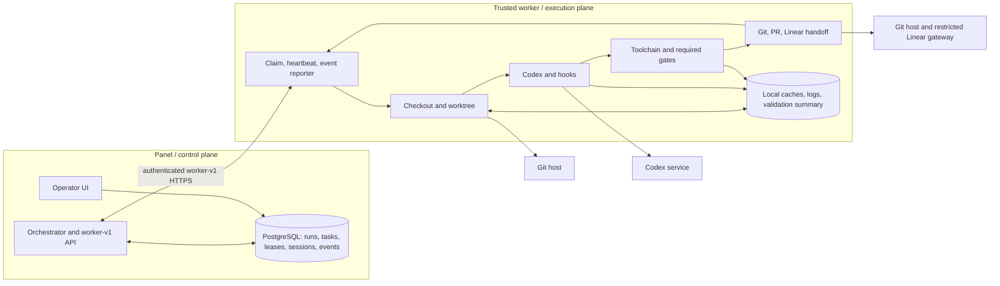

# External Execution Runtime Design

## 1. Status and ownership

This L3 document proposes the first production execution runtime: one trusted,
separately deployed worker that owns checkout, Codex, validation, and handoff. It is deliberately
not a general distributed-execution design.

The [Panel/Worker decoupling design](worker-panel-decoupling-design.md) remains the owner of the
landed worker-v1 API, queue, capability matching, sessions, leases, heartbeats, cancellation,
duplicate completion, expiry, and late-event behavior. PostgreSQL remains the only authority for
`run`, `task`, `task_lease`, worker-session, and operator-visible history. This proposal adds no
parallel lifecycle.

- **Current:** `centralized` is the default; the Panel-side worker-v1 lifecycle is landed; the
  external worker does not exist; the Panel image intentionally lacks project build toolchains.
- **Proposed:** the topology and execution responsibilities below, implemented in follow-up work.
- **Deferred:** durable remote artifacts and every item listed in [Deferred work](#8-deferred-work).

This ticket changes documentation only. It does not change runtime code, schema, API, dashboard,
Compose, or the default execution mode. Current L1/L4 contracts remain authoritative; see
[Architecture](ARCHITECTURE.md), [spec.md](spec.md),
[orchestration](spec-orchestration.md), [agent execution](spec-agent-runner.md),
[reliability and security](spec-reliability-security.md), and [logging.md](logging.md).

## 2. Selected topology and boundaries

Deploy one out-of-process worker in the same administrative trust domain as the Panel. It registers
and claims tasks through the existing worker-v1 HTTP API. Validation is a phase of the same worker
execution under the same lease; there is no verifier, second scheduler, or second lease.



The worker owns repository checkout/worktree creation and cleanup below a configured workspace
root, Codex app-server/session processes, workflow hooks, project toolchains, ordered validation,
local caches and logs, and git/PR/Linear handoff. It reports progress and results; it does not own
workflow selection, retries, leases, or terminal state.

| Boundary | Contract for the initial deployment |
| --- | --- |
| Trust and authentication | Panel authenticates the worker/session as defined by worker-v1. Both deployments are operated by one administrator. Capability declarations remain scheduling hints, never security attestations or authorization. |
| Filesystem | Panel never mounts or reads worker files. The non-root worker resolves every checkout, worktree, command cwd, and cleanup target beneath one configured absolute workspace root; caches have separate configured roots and are never command cwd. Repository content is untrusted. |
| Secrets | Worker receives only its Panel credential and least-scope repository push, Codex, PR, and restricted Linear credentials. It never receives Panel database credentials or a general Linear token. Secrets are injected at runtime, excluded from task payloads and local summaries, redacted from uploaded event detail, and rotated independently. |
| Network | Worker needs authenticated access only to Panel, Codex, configured Git/PR host, dependency registries required by the project, and the restricted Linear gateway. Deployment egress rules enforce this allow-list; capability fields do not. |
| Process | One supervisor owns a process group for each lease, including hooks, Codex, gates, and handoff commands. It enforces time/resource limits and reaps descendants. No execution subprocess runs in the Panel release. |

This resolves SYM-7 by putting Elixir/OTP, `make`, and the other project-required tools in the
worker image rather than expanding the minimal Panel image.

## 3. Minimal execution contract

The worker consumes the payload that the Panel produces from the project's **current workflow** at
an existing safe execution boundary. Runs and tasks do not pin a workflow record or version, and
the contract contains no `workflow_version_id`.

Every claimed execution identifies `project_id`, `run_id`, stable issue ID and human issue
identifier, run `attempt`, `task_id`, `lease_id`, lease `attempt`, and worker session. A **run
attempt** is an orchestrator retry or continuation and changes only when the Panel creates a new
run. A **lease attempt** is a claim/reassignment of the same task and increments without changing
the run attempt.

| Boundary | Panel input / authority | Worker responsibility and output |
| --- | --- | --- |
| Task queued | Persist `run` and `task` from the current workflow, including issue, repository/ref, prompt/command, hooks, required capabilities, and ordered required gates. | None until a compatible claim succeeds. |
| Worker registered | Authenticate worker session and retain advertised slots/capabilities. | Register, heartbeat, and advertise only available capacity and scheduling hints. |
| Claimed / lease acquired | Atomically return task and current lease identifiers, attempts, expiry, and execution payload. | Verify supported payload, start the lease supervisor, renew the lease, and emit accepted/progress events. |
| Workspace prepared | Lease remains authoritative. | Create a contained checkout/worktree at the requested revision; report resolved source revision or a typed preparation failure. |
| Codex / hooks | Payload supplies rendered prompt/command, hook commands, limits, and handoff policy resolved from the current workflow. | Run hooks and Codex in order; report phase, Codex session identifier, bounded redacted detail, duration, and typed outcome. |
| Required validation | Payload supplies ordered commands and timeouts. | Run every required gate in the final worktree, in order, within this lease; write the local machine-readable summary and report its bounded summary. |
| Git / PR / Linear handoff | Existing PR-first and restricted Linear rules remain authoritative. | Only after required gates pass, push the exact branch/commit, find or create the PR idempotently, then perform the allowed Linear handoff; report references or typed failure. |
| Terminal event | Panel applies the landed current-lease check and updates persisted task/run state. | Send one of `task.completed`, `task.failed`, or `task.cancelled` with phase, reason, validation summary, runtime identity, and handoff references. Retry duplicate delivery using existing idempotency behavior. |

Progress events need the envelope identifiers, phase/type, occurrence time, and bounded payload.
Terminal payloads additionally need outcome/reason; source revision; worker image tag or digest and
worker source revision; per-gate status, exit code, duration, and timeout; overall validation
status; and branch/commit/PR/Linear references when present. Panel logs use the issue and Codex
session context required by [logging.md](logging.md); local paths and secrets are not reported.

Only the current valid lease may change terminal task/run state. Duplicate terminal delivery is
idempotent. Events from an expired, cancelled, or superseded lease may be retained as evidence but
cannot overwrite newer work. These are existing Panel rules, not a new fencing subsystem.

Cancellation is cooperative first and forceful second. After a heartbeat returns `cancel_task`, the
worker starts no new phase, sends termination to the lease process group, escalates after a bounded
grace period, records whether descendants were reaped, cleans or quarantines the workspace, and
reports `task.cancelled` while the lease remains valid. If the worker cannot report before expiry,
Panel reconciliation remains authoritative and any later event is evidence only. External writes
already completed are reported; cancellation does not silently undo or repeat them.

### Small worker-v1 gaps for follow-up implementation

The landed payload is already opaque enough to carry execution input. Implementation needs only:

1. add stable issue ID, run attempt, and lease attempt to the claim payload/event envelope;
2. add ordered required gate commands/timeouts and the repository/ref/branch/handoff inputs needed
   by the worker; and
3. add bounded validation/runtime identity and handoff fields to progress/terminal event payloads.

These are the minimum API/schema/UI follow-ups. They do not change terminal semantics, introduce a
proposal/acknowledgment exchange, add cancellation epochs, or create another state machine.

## 4. Toolchain, validation, and local artifacts

The Symphony release owner builds and versions the project worker image alongside releases. A
terminal result reports the immutable image digest when available (otherwise its exact release tag)
and the worker source revision. The repository declares its ordered required commands in the
execution policy consumed by the current workflow; for this repository the single required gate is
`make all`, whose Makefile owns the internal order. The Panel places that resolved ordered list in
the task payload; the worker does not guess gates.

| Validation result | Meaning and terminal behavior |
| --- | --- |
| `passed` | Every required command exited zero within its limit. Handoff may proceed. |
| `failed` | A command exited non-zero or its required result could not be parsed. Terminal validation failure; no successful handoff. |
| `timed_out` | A command exceeded its declared limit and its process group was stopped. Terminal validation failure. |
| `cancelled` | Panel/operator cancellation interrupted validation. Terminal cancellation, never success. |
| `toolchain_unavailable` | A required executable/runtime is missing or incompatible. Terminal validation failure and worker/configuration evidence, never degraded success. |

A missing required gate declaration, command, or tool is not a skipped gate and cannot produce a
successful handoff.

Suggested worker-local layout (exact root names are deployment configuration):

```text
<workspace-root>/<project-id>/<task-id>/<lease-id>/  checkout/worktree, deps, _build
<cache-root>/repos/                                  bounded repository cache
<cache-root>/deps/                                   bounded dependency cache
<cache-root>/build/                                  bounded build cache
<log-root>/<task-id>/<lease-id>/                     redacted logs, validation.json
```

Successful task worktrees are removed after terminal reporting; failed or cancelled worktrees and
logs are quarantined for a short configured period (24 hours by default) and then removed. Caches
use configured byte/age limits with least-recently-used eviction. Startup and periodic cleanup
remove abandoned lease directories after confirming they are not active. Cleanup resolves and
checks every target beneath its configured root before deletion.

`validation.json` contains the envelope, source revision, runtime identity, ordered gate outcomes,
durations, exit codes, and overall status; it contains no secrets. The Panel persists only overall
and per-gate status, bounded failure detail, timestamps/durations, runtime identity, source/commit,
and handoff references. It never assumes access to worker paths. Worker-local detail may disappear;
durable remote logs or artifacts are deferred until a demonstrated operational need exists.

## 5. Failure and recovery

The detailed reconciliation contract remains in the
[Panel/Worker decoupling design](worker-panel-decoupling-design.md). The table below applies it only
to the single-worker runtime. Panel owns the existing retry policy and exponential backoff; worker
retries are bounded transport or idempotent phase operations within one live lease.

| Case | Retry owner / attempt effect | Visible status and evidence | Stale-completion guard |
| --- | --- | --- | --- |
| No worker or capability mismatch | Panel leaves task queued under scheduler polling/backoff; neither attempt changes. | Queued task, age, and mismatch/availability evidence. | No lease exists. |
| Worker crash/network loss; lease expires | Panel expiry/reconciliation requeues per existing policy; replacement claim increments lease attempt only. A later semantic retry may increment run attempt under normal retry policy. | Expired lease/session and last accepted event; queued/retried/final status per Panel policy. | Old lease is no longer current, so late terminal input is evidence only. |
| Panel restarts with active lease | Panel reloads PostgreSQL; worker resumes heartbeat. No attempt changes unless the lease expires. | Persisted active lease/session and accepted events remain visible. | Database current-lease record, not Panel memory, is authoritative. |
| Duplicate or late terminal event | Worker retries delivery; Panel performs existing idempotent handling. No attempt changes for a duplicate; requeue after expiry changes lease attempt. | One terminal transition plus duplicate/late audit evidence. | Only the current valid lease may mutate state. |
| Codex, hook, or validation failure | Worker reports typed terminal failure; Panel owns run retry/backoff. A semantic retry increments run attempt and creates its task. | Failed phase, bounded error/log detail, and validation summary where applicable. | Terminal event must match current lease. |
| Git, PR, or Linear handoff failure | Worker may retry an idempotent action within lease; exhaustion is typed failure and Panel owns later run retry/backoff. | Existing branch/commit/PR references plus failed handoff step and redacted error. | Terminal event must match current lease; handoff success cannot override failed validation. |
| Operator cancellation or requeue | Cancellation has no automatic run retry; worker stops process group and reports cleanup. Requeue follows existing Panel policy: replacement lease changes lease attempt, a new semantic run changes run attempt. | Actor/reason/time, cancellation or requeue state, cleanup outcome, and any completed external writes. | Revoked/expired lease cannot complete newer work. |

## 6. Delivery and rollback

| Slice | Delivery and validation gate | Main risk | Rollback criterion and action |
| --- | --- | --- | --- |
| 1. Worker image and runtime | Build the separately deployable non-root image; implement registration/claim/heartbeat, contained checkout, Codex/hooks, `make all`, process-group cancellation, local summaries, cleanup, and handoff. Gate: an end-to-end disposable-repository run plus clean-image `make all`, cancellation, workspace-escape, and crash/lease-expiry tests. | Workspace escape, leaked credential, orphan process, or silently skipped validation. | Any boundary violation or incorrect validation result: revoke/stop worker and route new work to `centralized`. |
| 2. Minimal worker-v1 metadata and Panel projection | Add the three payload/event gaps from Section 3 and display/log the persisted bounded summary. Gate: API contract tests for attempts, all validation outcomes, current-lease rejection, duplicate/late events, and restart recovery; `make all`. | Persisted state or UI implies success/access that does not exist. | Any lifecycle regression or misleading terminal state: disable worker dispatch and revert the additive projection while retaining history. |
| 3. Opt-in deployment and default decision | Deploy the trusted worker, verify one real project from claim through PR/Linear handoff, cleanup, and recovery; decide the default only after the worker path works. Gate: operational checklist plus required repository gate. | Toolchain/environment drift or unavailable worker stalls work. | Failed gate, repeated lease loss, or handoff divergence: stop new worker claims and switch execution back to `centralized`. |

Rollback changes routing for new work to `centralized`; it never deletes or rewrites persisted
runs, tasks, leases, sessions, or events. Centralized mode remains the pre-release fallback. Its
later removal requires a separate decision backed by a working worker path.

## 7. Follow-up implementation surface

Follow-up tickets may implement the worker image/runtime, the three worker-v1 payload/event gaps,
bounded Panel persistence and display of validation/runtime/handoff summaries, and opt-in deployment
configuration. This design does not authorize those changes in SYM-8.

## 8. Deferred work

The first worker does not include a verifier, object storage, signed artifact URLs, a generic
artifact service, SBOM/provenance attestation, capability attestation, Kubernetes/service mesh,
cluster canaries or capacity phases, multi-tenant/federated scheduling, live lease migration,
workflow version pinning, a terminal proposal/acknowledgment protocol, cancellation epochs, or a new
fencing/state subsystem. Durable remote artifacts require demonstrated loss/diagnostic needs and a
separate design.
